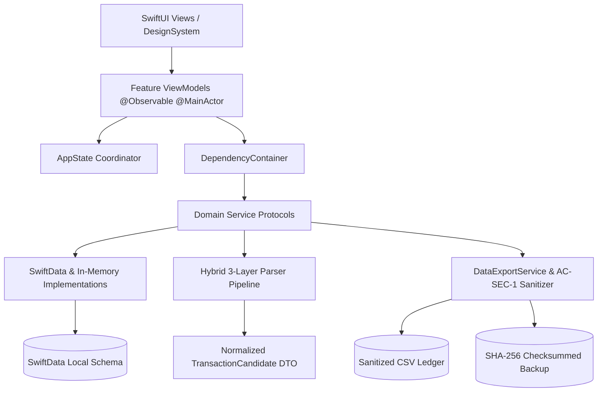

# Expense Manager — Architecture Guide

## 1. High-Level Architecture

Expense Manager is engineered using a **Feature-Oriented Clean Architecture** on **iOS 17+ / iOS 18+ (Swift 6)**, following modern Apple patterns (`@Observable`, `@MainActor`, `Sendable`, SwiftData, and Swift Concurrency).



---

## 2. Directory & Module Structure

```text
ExpenseManager/
├── App/
│   ├── ExpenseManagerApp.swift      # Main Application Lifecycle & DI Container setup
│   └── AppState.swift               # Observable App Navigation, Toasts, & Sheets
├── Core/
│   ├── AppIntents/                  # LogExpenseIntent, ParseTextExpenseIntent, ShortcutsProvider
│   ├── Confidence/                  # ConfidenceEngine & Ingestion Thresholds
│   ├── DependencyInjection/         # DependencyContainer & Environment Values
│   ├── DesignSystem/                # ColorTokens, Typography, Cards, Buttons, Badges
│   ├── Export/                      # DataExportService, CSVFormulaSanitizer, JSON Backup Models
│   ├── Intelligence/                # MerchantIntelligenceService (Recurring Subscriptions & Anomalies)
│   ├── Models/                      # SwiftData Persistent Schema Entities (@Model)
│   ├── Parsing/                     # Deterministic NLP Tokenizer & Regex Pipeline
│   ├── SMSParsing/                  # Indian Bank SMS Parsers & AC-PARSE-2 Safety Classifier
│   ├── Storage/                     # SwiftData Services, DatabaseContainer, & In-Memory Mocks
│   ├── Utilities/                   # CurrencyFormatter (Decimal), DateFormatterHelper, AppLogger
│   └── Voice/                       # AudioRecordingService (AVAudioEngine + SFSpeechRecognizer)
├── Domain/
│   ├── Services/                    # Domain Service Protocols
│   │   ├── TransactionServiceProtocol.swift
│   │   ├── AccountServiceProtocol.swift
│   │   ├── CategoryServiceProtocol.swift
│   │   ├── ParserServiceProtocol.swift
│   │   ├── BudgetServiceProtocol.swift
│   │   └── DataExportServiceProtocol.swift
│   └── Types/                       # Immutable Domain Transfer Objects & Enums
│       ├── TransactionCandidate.swift
│       ├── ConfidenceScore.swift
│       ├── TransactionType.swift
│       ├── InputSource.swift
│       ├── AccountType.swift
│       ├── CategoryType.swift
│       ├── PaymentMethod.swift
│       ├── ToastMessage.swift
│       ├── AccountDTO.swift
│       ├── CategoryDTO.swift
│       └── BudgetDTO.swift
├── Features/
│   ├── Accounts/                    # AccountsListView, AccountComposerView, AccountsListViewModel
│   ├── Analytics/                   # AnalyticsOverviewView, AnalyticsViewModel (Swift Charts)
│   ├── Budgets/                     # BudgetsOverviewView, BudgetComposerView, BudgetsViewModel
│   ├── Categories/                  # CategoriesManagementView, CategoryComposerView, CategoriesViewModel
│   ├── Dashboard/                   # DashboardView, DashboardViewModel (Net Worth, Hero Cards, Quick Actions)
│   ├── ManualEntry/                 # ManualTransactionComposerView, ManualTransactionComposerViewModel
│   ├── ReviewQueue/                 # ReviewQueueView, ReviewQueueViewModel
│   ├── Root/                        # RootView, RootViewModel (Tab Shell & Toast Coordinator)
│   ├── Settings/                    # SettingsView, SettingsViewModel, SMSAutomationGuideView, PrivacyGuaranteeView
│   ├── SmartEntry/                  # SmartTextComposerView, SmartTextComposerViewModel
│   ├── SMSDiagnostics/              # SMSDiagnosticsView, SMSDiagnosticsViewModel (Sandbox)
│   ├── Transactions/                # TransactionsListView, TransactionDetailView, TransactionsListViewModel
│   └── VoiceEntry/                  # VoiceEntryView, VoiceEntryViewModel (Live Waveform Meter)
└── Tests/
    ├── EntryTests/                  # ManualAndSmartEntryTests
    ├── ExportTests/                 # DataExportAndSecurityTests (AC-SEC-1 & Checksum validation)
    ├── FeaturesTests/               # Dashboard, Analytics, Budgets, Accounts, Search & Filter tests
    ├── FinancialEngineTests/        # FinancialEngineTests (Exact Decimal arithmetic)
    ├── FoundationTests/             # ArchitectureFoundationTests (DI Container, AppState, AppLogger)
    ├── ParserTests/                 # ConfidenceEngineTests, HybridParserTests
    ├── SMSParsingTests/             # BankSMSParserTests, SMSSafetyClassifierTests, DuplicatePreventionTests
    └── VoiceAndIntentTests/         # VoiceAndIntentTests (Speech Recognition & App Intents)
```

---

## 3. Core Architectural Principles & Security Invariants

### 3.1 Financial Precision (`Decimal` Invariant: `FIN-DECIMAL`)
- **Zero Floating-Point Arithmetic**: All monetary quantities (`amount`, `balance`, `limitAmount`, `spentAmount`, totals) are strictly stored and manipulated as `Decimal`.
- **Never `Double` or `Float`** for monetary values.
- **Deterministic Math**: Totals, balances, and budget calculations are computed strictly by deterministic Swift application code — never delegated to an LLM.

### 3.2 Unified Ingestion Pipeline
All entry channels (Manual, Smart Text, Voice, SMS, Siri, OCR) feed into the **same normalized pipeline**:
```text
Raw Ingestion (Manual / Smart Text / Voice / SMS / Siri)
      ↓
Input Normalizer
      ↓
AC-PARSE-2 Safety Classifier (Reject OTPs, Declined, Bill Reminders, Spam)
      ↓
Hybrid Parser (Bank Regex -> Learned Rules -> Foundation Model)
      ↓
TransactionCandidate (DTO with ConfidenceScore)
      ↓
Confidence Engine (>=0.90 Auto-Save | 0.65–0.89 Review Recommended | <0.65 Review Queue)
      ↓
Duplicate Detection Engine (SHA-256 Source Hash & 5-Minute Sliding Window)
      ↓
SwiftData Persistent Ledger
```

### 3.3 CSV Formula Injection Neutralization (`AC-SEC-1`)
- **Vulnerability Defense**: Protects against CSV Formula Injection / Formula Injection Attacks (CWE-1236).
- **Rule**: Any string field (Merchant name, notes, category, account, reference, tag) starting with `=`, `+`, `-`, `@`, `\t`, `\r` **MUST** be prefixed with `'` (single quote) during CSV generation.
- **RFC-4180 Escaping**: Fields containing commas, double quotes (escaped as `""`), or newlines are wrapped in standard RFC-4180 quotes.

### 3.4 Cryptographic JSON Backup & Restore
- **Payload Integrity**: Complete SwiftData stores are serialized into structured JSON packages containing accounts, categories, tags, transactions, budgets, and merchant rules.
- **SHA-256 Checksums**: The JSON-encoded content is cryptographically signed with a SHA-256 hash. During restoration, the checksum is verified prior to touching the local database. Tampered backup files are strictly rejected.

### 3.5 Privacy & Sensitive Data Protection
- **Zero Sensitive Logging**: Full bank account numbers, complete card numbers, and raw SMS payloads are sanitized by `AppLogger` (`•••• 4321`, `FP-A84B91E2`).
- **100% Local-First**: Transactions and accounts reside in local on-device SwiftData persistence.
- **Zero Third-Party Telemetry**: No external analytics, crash reporters, or tracking SDKs.

### 3.6 Dependency Injection & Preview Architecture
- Every feature depends only on **Domain Protocols** (`TransactionServiceProtocol`, `AccountServiceProtocol`, `DataExportServiceProtocol`, etc.).
- `DependencyContainer` provides `.mock()` for instant, deterministic SwiftUI previews and unit tests, and `.live(modelContainer:)` for runtime production.
- Views access state and dependencies cleanly through `@Environment(\.appState)` and `@Environment(\.dependencyContainer)`.

---

## 4. Quality Bar & Verification Checklist

| Pillar | Requirement | Verification Standard |
| :--- | :--- | :--- |
| **Concurrency** | UI isolated to `@MainActor`, data transfers conform to `Sendable` | Swift 6 strict concurrency checks |
| **Financial Math** | `Decimal` arithmetic, INR locale support (`₹`), Indian numbering scale | Unit tests in `FinancialEngineTests.swift` |
| **Security (CSV)** | Formula triggers (`=`, `+`, `-`, `@`, `\t`, `\r`) single-quote escaped | Unit tests in `DataExportAndSecurityTests.swift` |
| **Security (SMS)** | Non-transaction messages (OTPs, declined alerts, spam) rejected (AC-PARSE-2) | Unit tests in `SMSSafetyClassifierTests.swift` |
| **Security (Deduplication)**| 5-minute sliding window and SHA-256 fingerprint matching | Unit tests in `DuplicatePreventionTests.swift` |
| **State Management** | `@Observable` with fine-grained re-renders | Observable `@Bindable` properties |
| **Persistence** | SwiftData schema with explicit cascade delete rules & in-memory test stores | DatabaseContainer factory methods |
| **Design** | HIG compliance, Dynamic Type, Dark/Light mode tokens, 44x44pt tap targets | Standardized `ColorTokens` & `Typography` |
